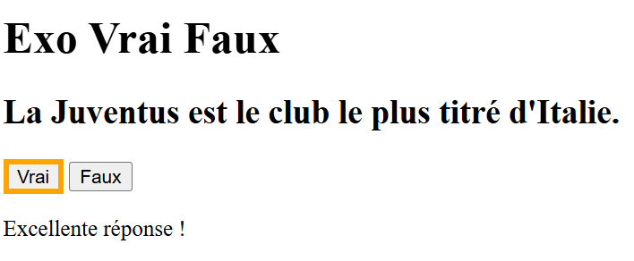

# Exercice Vrai Faux
Créer une micro-application avec la technologie de votre choix parmi ces 3 approches:
- html/css/js pur
- react
- react native
  
Cette application devra afficher une affirmation sous forme de texte.  
Exemple: La Juventus est le club le plus titré d'Italie. 
L'interface proposera deux boutons: Vrai et Faux 
En fonction du bouton cliqué un message de succès ou d'erreur apparaîtra. 

  
Me fournir de préférence, dans un simple fichier texte, l'url de votre dépôt de code ou alors un zip contenant votre code source.